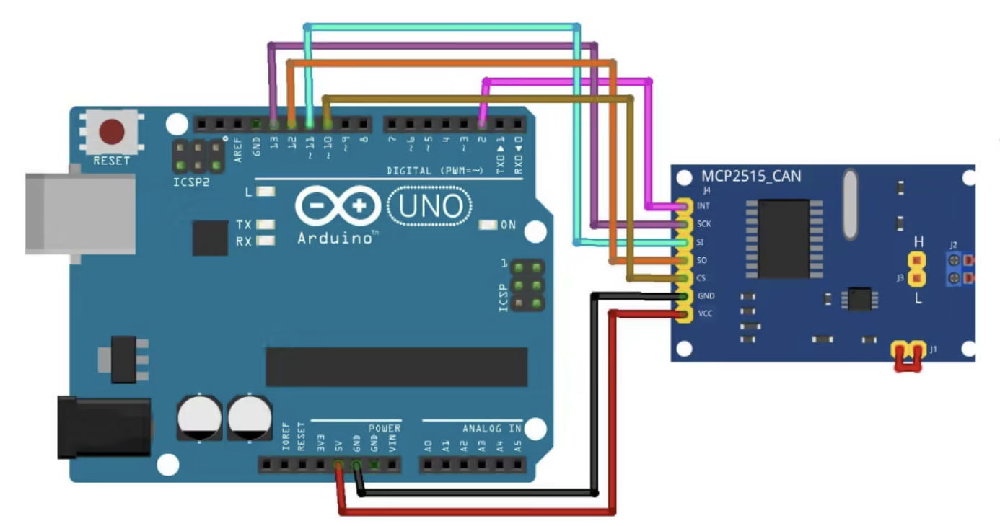

Le but ici est de simuler la communication dans une voiture de manière assez simplifié en passant par un controller CAN (MCP2515). Nous utilisons la librairie mcp2515 fourni par autowp (https://github.com/autowp/arduino-mcp2515).

La connection entre l’arduino et le MCP2515 est faite en spi et le MCP2515 permet d’envoyer les données sur le bus. 

L'arduino envoie des données comme la vitesse, le régime moteur ou encore la température de l'huile. La vitesse est représentée par un potentiomètre sur le breadboard. C'est aussi le cas du régime moteur. Le frein est représenté par le bouton poussoir.

## Câblage pour le bus CAN

Connection en SPI entre la carte arduino et le controller MCP 2515.

## Câblage général

Les entrées analogiques de l’Arduino sont utilisées pour simuler les commandes et états du véhicule. La broche A0 est reliée à un potentiomètre représentant l’accélérateur ; sa valeur analogique comprise entre 0 et 1023 est interprétée comme une consigne de vitesse. La broche A5 est connectée à un second potentiomètre simulant le régime moteur (RPM), dont la valeur est convertie linéairement en une plage réaliste de 0 à 8000 tr/min. Enfin, la broche A1 est utilisée de manière optionnelle afin d’initialiser le générateur de nombres pseudo-aléatoires (randomSeed()), permettant de produire des valeurs de température moteur variables et non déterministes.

Nous avons suivi le tutoriel suivant : https://arduino.developpez.com/tutoriels/arduino-a-l-ecole/?page=projet-10-le-potentiometre

