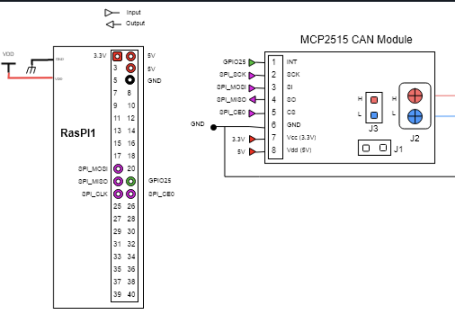

# Aquisition des donnés sur le bus can

[TOC]

## Rapport avancement  (19/12)

### 1. Contexte 

Dans le cadre du projet D.I.N.O., une des composantes principales consiste à développer une ** interface d'acquisition pour un bus CAN** éxécuté sur une **Raspberry Pi connectée au véhicule**.
Ce serveur fournira une interface pour permetre au serveur web de récuperer les données de conduite.

### 2. état actuel de l'implémentation

Nous avons déjà mis en place une architecture physique pour pouvoir aquérir les data depuis le bus can vers la raspi. Actuellement, le module mcp2515 semble fonctionner, mais l'interface spi qui permet a la raspi de lire les donnés ne se synchronise pas.

### 3. Objectifs suivants:

Dans les prochains jours, nous avons définis plusieurs objectifs:
- Arriver a lire cette fameuse liaison spi
- Definir une interface en collaboration avec l'équipe web.

### 4. Conclusion
Si notre projet est actuellement bloqué par les difficultés à la lecture du bus CAN, nous avons toutde même des perspectives d'évolution pour pouvoir assez rapidement mettre en place une première phase du poc.

## Rapport d'avancement 07/01

La communication CAN entre Arduino et Raspberry pi marche enfin, le problème était lié au Mac qui ne délivrait pas 5V à l'arduino.

### interface can de la raspi
sudo ip link set can0 type can bitrate 250000 loopback off
sudo ip link set can0 up

### config raspi en mode hotspot
down interface wlan0 (sudo ip a d @ip dev wlan0)
up interface wlan0 avec 192.168.1.1/24 (sudo ip a a 192.168.1.1/24 dev wlan0)
sudo hostapd /etc/hostapd/hostapd.conf


## Rapport d’avancement (19/01)

Lors du démarrage de la Raspberry Pi, l’initialisation complète du système est désormais automatisée grâce à un service systemd.

Ce service, décrit dans le fichier `dino.service`, lance l’exécution d’un script de démarrage qui :

* configure l’interface CAN (`can0`) avec les paramètres appropriés,
* configure l’interface Wi-Fi (`wlan0`),
* active le mode hotspot,
* démarre automatiquement le serveur Flask.

Une fois le script exécuté, la Raspberry Pi agit comme un point d’accès Wi-Fi autonome.
Un utilisateur peut alors se connecter au réseau Wi-Fi de la carte et accéder à l’application web via un navigateur à l’adresse suivante :

```
http://192.168.1.1:5000/
```

Cette configuration permet une utilisation totalement embarquée du système, sans intervention manuelle après le démarrage de la carte.

### Emplacement des fichiers de configuration sur la Raspberry Pi

* Configuration du point d’accès Wi-Fi :
  `/etc/hostapd/hostapd.conf`

* Configuration du serveur DHCP/DNS :
  `/etc/dnsmasq.conf`

* Script de démarrage du projet :
  `/usr/local/bin/start_dino.sh`

* Service systemd :
  `/etc/systemd/system/dino.service`

## Configuration de l'interface CAN

Câblage :



Une fois que tout est bien branché, il faut activer SPI (pour communiquer avec MCP2515)

```
sudo raspi-config
```
Puis aller dans, Interfacing Options → SPI → Enable

Ensuite, il faut modifier le fichier /boot/firmware/config.txt. Ajouter : 

```
# Activer le SPI matériel
dtparam=spi=on
# Interface CAN can0 via MCP2515
# - oscillator = fréquence du quartz du module (8 MHz ici)
# - interrupt  = GPIO utilisé pour INT (GPIO25)
dtoverlay=mcp2515-can0,oscillator=8000000,interrupt=25
# Utiliser le driver SPI bcm2835
dtoverlay=spi-bcm2835
# Activer le SPI DMA 
dtoverlay=spi-dma
```
Puis nous Utilisons la librairie can-utils pour reçevoir (candump <nom_interface>) ou écrire (cansend <nom_interface> <message>), ici nous n'utilisons pas l'écriture dans le bus.

Nous avons suivi le tutoriel (https://github.com/tolgakarakurt/CANBus-MCP2515-Raspi/tree/master?tab=readme-ov-file)


